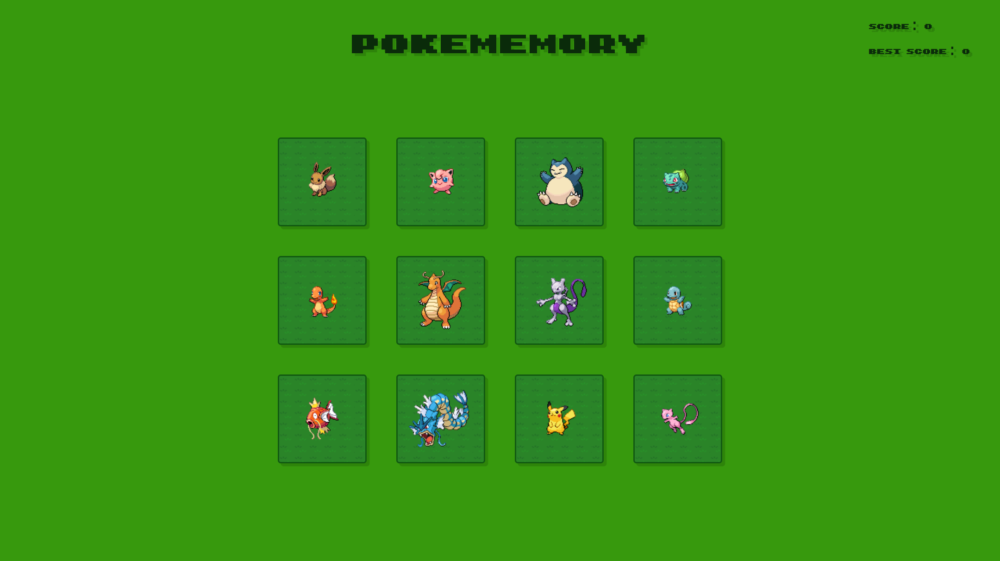

# Pokememory 🃏

Pokemon memory game web app.

## Demo

<p align="center">
  
</p>
<h2 align="center">
  <a href="https://amadeuio.github.io/pokememory">👉 Demo</a>
</h2>

## Features

Classic memory game with Pokemon.

- Uses [PokeAPI](https://pokeapi.co/) to render the Pokemon sprites
- Simple and user friendly UI
- Realtime score and best score count
- Clicked Pokemon are revealed at the end of the game, with right / wrong feedback
- Responsive

## Tech Stack

- **UI Library:** React
- **Languages:** TypeScript, CSS, HTML
- **Build Tool:** Vite
- **Dependencies:** styled-components, uuid

## File Structure

- `/src`: Contains the source code

  - `/src/components`: React and styled components
  - `/src/App.tsx`: Main component responsible for managing state and rendering components of the app
  - `/src/main.tsx`: Entry point for the React app
  - `/src/initialData.ts`: Creation and initialization of the `Game` and `Pokemon` data, with corresponding type definitions

- `/docs`: Distribution files generated during the build, GitHub pages is reading the root of this directory

- `/public`: Images and font

- `index.html`: Entry point for the app

## Data

The app uses objects to keep track of the state of the game. You'll find them created in [`initialData.ts`](/src/initialData.ts). It consists of two main objects:

### 1. `Pokemon` Object:

Represents each Pokemon you see on screen.

**Properties**

- `id`
- `name`
- `isTouched`
- `isTouchedTwice`

There's no need to store a link or image in the object because the [`PokeComponent`](/src/components/PokeComponent.tsx) automatically retreives the sprite form PokeAPI with the Pokemon name.

### 2. `Game` Object:

Represents the state of the game.

**Properties**

- `pokeList` (array of 12 `Pokemon` objects)
- `score`
- `bestScore`
- `hasLost`
- `hasWon`

The game object is the state variable which the React app is constantly updating and rendering to create the flow of the game.

The `pokeList` is created from an array of string names and a `Pokemon` class, since the UI renders the Pokemon sprites, the names in the array can be changed to any Pokemon, the app will immediately work just fine.

In the initial game data, the `pokeList` is initializated with a getter function that calls a `shuffleArray` utility function. This ensures every time the initial data is accessed, the order of the Pokemon is random. This is useful for the particular functionlity and use case of this app. For example, the reset button just needs to access initial data again for it's functionality.

## Run Locally

Clone the project

```bash
  git clone https://github.com/amadeuio/pokememory
```

Go to the project directory

```bash
  cd pokememory
```

Install dependencies

```bash
  npm install
```

Start the server

```bash
  npm run dev
```

## Acknowledgements

- [PokeAPI](https://pokeapi.co/)
- [GPT](https://chat.openai.com/)
- [shields.io](https://shields.io/)

## License

[MIT](https://choosealicense.com/licenses/mit/)
